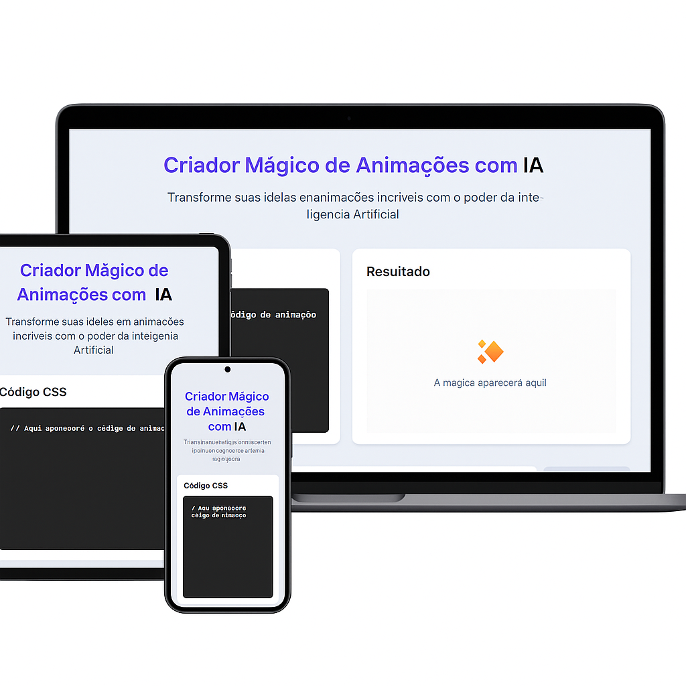

# 🤖 Projeto IA - Interface Moderna e Interativa

Este projeto é uma interface web moderna que demonstra conceitos de animação e interatividade usando tecnologias web fundamentais. O design foi criado para ser intuitivo, responsivo e visualmente atraente.



## 🚀 Tecnologias Utilizadas

- **HTML5**: Estruturação semântica do conteúdo
- **CSS3**: Estilização avançada com:
  - Variáveis CSS (Custom Properties)
  - Flexbox e Grid para layouts responsivos
  - Animações e transições
  - Media Queries para responsividade
  - Gradientes
- **JavaScript**: Interatividade e manipulação do DOM
- **Fontes**:
  - Inter (texto principal)
  - JetBrains Mono (código)

## ✨ Funcionalidades

### 1. Design Responsivo

- Layout adaptativo que funciona em diferentes tamanhos de tela
- Grid system flexível
- Breakpoints otimizados para mobile

### 2. Elementos Interativos

- Botões com efeitos de hover
- Campos de input com feedback visual
- Seções com sombras e efeitos de profundidade

### 3. Animações

- Bola verde com animação de escala
- Transições suaves nos elementos interativos
- Feedback visual nas interações do usuário

### 4. Área de Código

- Área dedicada para visualização de código CSS
- Fonte monoespaçada para melhor legibilidade
- Estilização específica para código

### 5. Área de Resultado

- Espaço para visualização de resultados
- Placeholder interativo
- Feedback visual claro

## 🎨 Estilo e Design

O projeto utiliza uma paleta de cores cuidadosamente selecionada:

- Cor primária: `#6366f1`
- Cor de hover: `#4f46e5`
- Cor de fundo: `#e2e8f0`
- Cor do texto: `#1e293b`

Outros elementos de design incluem:

- Border radius consistente
- Sistema de sombras para profundidade
- Gradientes para elementos de destaque

## 📱 Responsividade

O site é totalmente responsivo com breakpoints em:

- Mobile: < 640px
- Tablet e Desktop: > 640px

Ajustes específicos para mobile incluem:

- Padding reduzido
- Stack vertical para grupos de input
- Botões em largura total
- Grid adaptativo

## 🚀 Como Executar o Projeto

1. Clone o repositório:

```bash
git clone [URL do repositório]
```

2. Abra o arquivo `index.html` em seu navegador

3. Para desenvolvimento, recomendamos usar um servidor local como Live Server do VS Code

## 📝 Licença

Este projeto está sob a licença incluída no arquivo LICENSE.

## 🤝 Contribuições

Contribuições são sempre bem-vindas! Sinta-se à vontade para abrir uma issue ou enviar um pull request.

## 🧠 Funcionalidades de IA

### 1. Geração de Animações CSS

- A IA analisa o código CSS inserido pelo usuário
- Gera automaticamente animações personalizadas baseadas no contexto
- Otimiza parâmetros de animação para melhor performance visual

### 2. Sugestões Inteligentes

- Oferece recomendações em tempo real para melhorar o código CSS
- Sugere propriedades e valores baseados em boas práticas
- Identifica potenciais problemas de compatibilidade entre navegadores

### 3. Análise de Performance

- Avalia o impacto das animações no desempenho
- Sugere otimizações quando necessário
- Monitora o uso de recursos do navegador

### 4. Personalização Adaptativa

- Aprende com as preferências do usuário
- Ajusta sugestões baseadas no histórico de uso
- Oferece alternativas personalizadas para cada estilo

### 5. Compatibilidade Cross-Browser

- Verifica automaticamente a compatibilidade com diferentes navegadores
- Gera prefixos necessários (-webkit, -moz, etc.)
- Sugere alternativas para propriedades não suportadas

### 6. Feedback em Tempo Real

- Visualização instantânea das alterações
- Análise de contraste e acessibilidade
- Sugestões de melhorias de design

### 7. Exemplos Interativos

- Biblioteca de exemplos gerados pela IA
- Demonstrações práticas de diferentes tipos de animações
- Código-fonte comentado para aprendizado

### 8. Assistente de Debug

- Identifica e sugere correções para problemas comuns
- Explica o funcionamento das propriedades CSS
- Oferece dicas de otimização

## 🔄 Fluxo de Trabalho com IA

1. **Input do Usuário**

   - Digite ou cole seu código CSS
   - Descreva o efeito desejado
   - Selecione preferências de estilo

2. **Processamento da IA**

   - Análise do código existente
   - Geração de sugestões
   - Otimização de performance

3. **Resultado**

   - Visualização em tempo real
   - Código CSS otimizado
   - Documentação automática

4. **Iteração**
   - Feedback do usuário
   - Ajustes finos
   - Aprendizado contínuo
